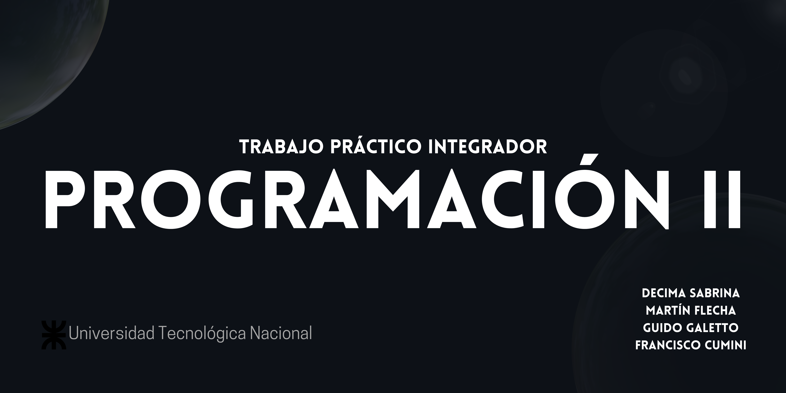

# Proyecto Integrador - Programación II

Este proyecto integrador fue desarrollado como parte de la materia Programación II en la Tecnicatura Universitaria en Programación en la Universidad Tecnológica Nacional (UTN), Facultad Regional Rosario.

## Integrantes del Grupo
- **Martín Flecha**
- **Sabrina Décima**
- **Guido Galetto**
- **Francisco Cumini**

## Descripción del Proyecto
Este proyecto tiene como objetivo mostrar las cotizaciones actuales de todos los tipos de cambio y permitir al usuario visualizar la evolución de una moneda específica a lo largo del tiempo.

### Estructura del Proyecto

#### 1. **Inicio** (`index.html`)
   - Pantalla principal con las cotizaciones actuales de todos los tipos de cambio disponibles.

#### 2. **Histórico** (`historico.html`)
   - Página que incluye un gráfico y una tabla para mostrar la evolución de una moneda seleccionada por el usuario. El usuario puede elegir ver los datos completos, del último mes, de un intervalo determinado o seleccionar una fecha específica.

#### 3. **Menú - Navbar**
   - El menú está presente en todas las pantallas y permite al usuario navegar entre las diferentes secciones del proyecto. El botón de la página activa debe estar resaltado de manera visible para que el usuario pueda identificar en qué sección se encuentra.

#### 4. **Pie de Página **
   - Contiene los datos de los integrantes del grupo, el curso, y la materia. Además, incluye la fuente de referencia de la API utilizada: [dolarapi.com](https://dolarapi.com).

#### 5. **Enviar Mail**
   - Cada página tiene un botón que permite enviar un correo electrónico con la información que se está consultando en ese momento. El texto del botón será: _"Send me the info please"_.

#### 6. **Indicador de Actualización**
   - Todas las páginas incluyen un botón o texto que indica si la página está actualizada. Los datos provienen de una API externa, por lo que es importante señalar si la información es reciente.

## Tecnologías Utilizadas
- HTML5
- CSS3
- JavaScript
- API Externa: [dolarapi.com](https://dolarapi.com)

## Instalación y Uso
Para visualizar este proyecto, simplemente descarga los archivos y abrir el index.html en un navegador web.

## Licencia
Este proyecto es de uso académico y fue desarrollado como parte del curso Programación II en UTN.

